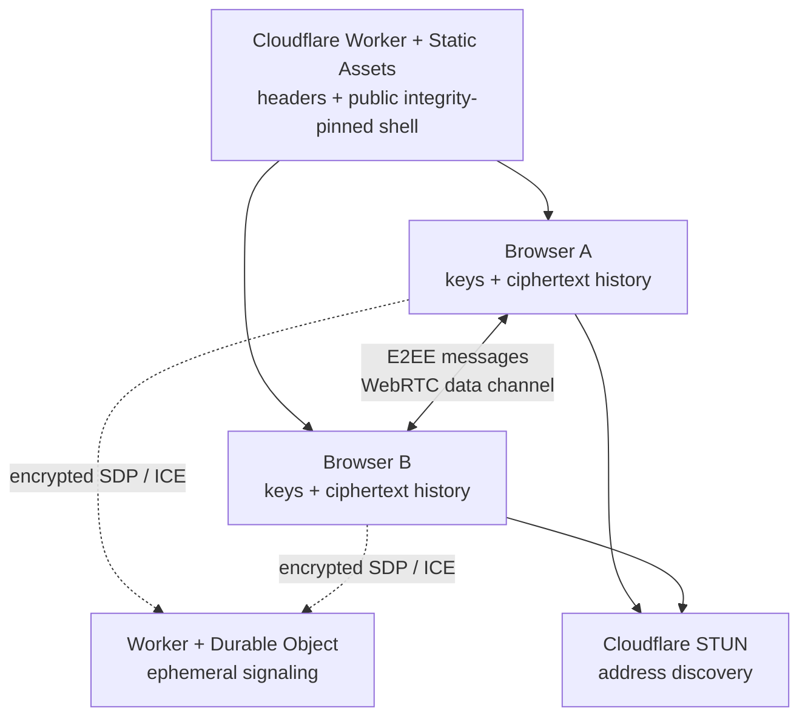

# QuietWire

[](https://github.com/SeriousPassenger/cloudflare-p2p-e2ee-chat/actions)

QuietWire is a browser-first, peer-to-peer, end-to-end encrypted chat that deploys to Cloudflare Workers. Every HTTP request passes through the Worker for HTTPS enforcement and security headers before the Static Assets binding serves the application; a Durable Object temporarily relays encrypted WebRTC setup packets. Chat messages travel directly between participants over WebRTC data channels. The Worker does not store messages, room secrets, private keys, or public keys.

> **Security status:** this is an initial, unaudited MVP—not a production-ready replacement for a professionally audited messenger. The experimental FIPS 203 ML-KEM-768 layer uses a pure-JavaScript implementation and an application-specific composition. Review [SECURITY.md](SECURITY.md) and the [threat model](docs/THREAT-MODEL.md) before relying on it for sensitive communication.

## What it provides

- Direct, ordered peer-to-peer messaging with WebRTC `RTCDataChannel` in a small-group full mesh.
- A Cloudflare Durable Object used only as an ephemeral WebSocket signaling rendezvous. Signaling bodies are AES-256-GCM encrypted in the browser with a key derived from the room secret.
- Locally generated OpenPGP v4 Curve25519 identities using standardized Ed25519 signing and X25519 encryption. Private keys remain in the browser, passphrase-encrypted at rest.
- Per-message OpenPGP Curve25519 encryption/signatures plus an experimental outer FIPS 203 ML-KEM-768/AES-256-GCM confidentiality layer.
- Full OpenPGP fingerprints, grouped fingerprint display, copy/QR tools, and explicit out-of-band verification guidance.
- Encrypted chat history—ciphertext plus signed delivery metadata—in browser IndexedDB until the user purges it.
- A complete, passphrase-protected `.quietwire.json` identity backup containing both the OpenPGP and ML-KEM recovery material, plus separate OpenPGP public/private exports and a revocation certificate.
- English, German, Japanese, Turkish, Spanish, French, Simplified Chinese, and Traditional Chinese, with local automatic language selection.
- Same-origin-only Content Security Policy, restrictive browser permissions, no third-party runtime resources, no analytics, and Workers observability disabled in configuration.
- A trust-on-first-use integrity Service Worker that verifies and pins the manifest-listed HTML, JavaScript, CSS, and stamped integrity worker in a build-specific cache; it never handles `/api` traffic or caches user data.
- Mandatory startup checks for HTTPS, cross-origin isolation, WebCrypto, OpenPGP, ML-KEM, IndexedDB, WebRTC, resource isolation, pinned-shell integrity, and the signaling health contract.
- Optional developer JSON with separate redacted application/room/message metadata panels and a nested, collapsed per-message view of the raw encrypted transport envelope. Neither view includes plaintext, private keys, passphrases, or the room secret.
- A direct-only network policy in this release. No TURN relay credentials or message-delivery service are included.

## Architecture



The random 256-bit room secret is stored in the URL fragment (`#room=…`). Browsers do not send fragments in HTTP requests. Treat the complete link as a capability: anyone who obtains it can attempt to join. The client derives:

- a SHA-256 room identifier, which the Durable Object uses for rendezvous; and
- an HKDF-SHA-256/AES-256-GCM key, which encrypts SDP and ICE signaling contents before they reach Cloudflare.

The Durable Object sees the derived opaque room identifier, temporary peer identifiers, connection timing, encrypted envelopes, and normal network metadata. It keeps current WebSocket connection state so peers can find one another, but the application never calls Durable Object storage, D1, KV, R2, or Queues. Signaling requires an exact same-origin WebSocket `Origin`, a room is capped at eight signaling peers, and each socket is limited to 200 signaling messages per 10 seconds. The client also enforces its eight-peer roster limit and stops accepting new identities after 32 unique peer IDs in one tab session. These are abuse bounds, not authentication or complete denial-of-service protection.

Once WebRTC connects, peers exchange identity information and E2EE chat packets over the direct data channel. Each device retains only its own local ciphertext history. There is no central transcript and no offline mailbox.

After every intended participant has connected, a user can **locally lock signaling**. This permanently closes that tab's signaling WebSocket for the current room session while its established WebRTC data channels continue. It does not lock the room on the server, revoke the invite, disconnect other peers from signaling, or stop people with the link from forming connections that do not involve the locked tab. A refresh/leave starts a new session; a locked tab cannot negotiate a new peer or recover a connection after a network/topology change.

The versioned message envelope is `OpenPGP-Curve25519+ML-KEM-768/AES-256-GCM-v1`: OpenPGP.js first creates a classically encrypted and signed inner message. Every message gets a fresh random AES-256 content key that encrypts that inner armor, and a recipient-specific key derived from an ML-KEM-768 encapsulated secret wraps the content key. QuietWire has no shared room key, so joins, leaves, and trust changes affect the next sender-selected recipient set without a group-key rotation. This is not X-Wing wire compatibility; the project avoids claiming a draft X-Wing construction that it does not implement.

QuietWire does not accept or reuse SSH private keys. An SSH Ed25519 key is an authentication credential, not an OpenPGP message-encryption identity; reusing it would expand the impact of a compromise. Use a dedicated OpenPGP identity generated by or imported into the application.

OpenPGP imports are intentionally restricted to valid, unexpired, non-revoked v4 identities with a complete 40-hex fingerprint, Ed25519 signing key, and X25519 encryption key. Standard and legacy OpenPGP Curve25519 encodings are accepted; RSA, NIST P-curve, other-algorithm, and v6/64-hex-fingerprint keys are rejected rather than silently changing the advertised security profile.

| Data | Where it exists | Sent to Cloudflare application code? |
| --- | --- | --- |
| Room secret | URL fragment and browser memory | No |
| Private OpenPGP/PQ key material | Browser memory; passphrase-protected identity in IndexedDB; explicit downloaded backup if the user creates one | No |
| Public keys and chat plaintext | Participant browsers | No |
| Chat ciphertext | Participant data channels and each participant's IndexedDB | No |
| Encrypted SDP/ICE | Browser, Worker, and Durable Object WebSocket | Yes, transiently |
| Derived room ID, peer IDs, IP/timing metadata | Browser and Cloudflare | Yes |
| Integrity shell cache | Browser Cache Storage; public HTML/JS/CSS, stamped integrity worker, and manifest only | Public assets originate at Cloudflare; no user data |

See [docs/THREAT-MODEL.md](docs/THREAT-MODEL.md) for the complete trust and limitation analysis.

## Deploy to Cloudflare

Requirements: a Cloudflare account, Node.js 22 or newer, and npm.

```bash
git clone https://github.com/SeriousPassenger/cloudflare-p2p-e2ee-chat.git
cd cloudflare-p2p-e2ee-chat
npm ci
npx wrangler login
npm run deploy
```

The deploy script builds the client, stamps the integrity Service Worker for that shell, creates the pinned-shell integrity manifest/build digest, checks generated files for known analytics markers and external HTML script/style references, creates the SQLite-backed Durable Object class from `wrangler.jsonc`, uploads the static assets, and deploys the Worker. No application secret, persistent application database, TURN account, or separate backend is needed. `assets.run_worker_first` is globally `true`, so the Worker can redirect the very first HTTP visit and apply the same security headers to every response before serving a static asset. This means network asset requests invoke the Worker; after first installation, the build-specific integrity cache serves the pinned shell locally and minimizes repeated edge requests.

The deployed `workers.dev` URL is an HTTPS secure context. For a custom hostname, add a Worker custom domain in the Cloudflare dashboard; do not create a cross-account CNAME to another Cloudflare hostname.

Cloudflare account-level settings can still inject Browser Insights or Web Analytics. Disable those features and verify the final response as described in [docs/DEPLOYMENT.md](docs/DEPLOYMENT.md). The repository's CSP is a second line of defense, not a reason to leave injection enabled.

## Local development

Install dependencies, then run the Wrangler-based development command:

```bash
npm ci
npm run dev
```

`npm run dev` builds the integrity-pinned client and starts Wrangler with the Worker, Static Assets, and Durable Object. Open the localhost URL it prints; localhost is treated as a secure context by modern browsers. Two separate browser profiles provide the most realistic local peer test.

Useful checks:

```bash
npm run typecheck
npm test
npm run build
npm run check
```

`npm run build` first hashes the generated non-Service-Worker shell and stamps that shell digest into `integrity-worker.js`. It then hashes the stamped worker together with the HTML, CSS, and JavaScript into `integrity-manifest.json` and the complete build digest. The build scans generated HTML, CSS, JavaScript, and JSON for known Cloudflare RUM/analytics markers and rejects remote or protocol-relative `<script src>` and `<link href>` references in generated HTML. This is deliberately narrower than a proof that no remote URL can be constructed at runtime, so startup checks and deployed Network inspection remain required.

## Use fingerprints correctly

Encryption without authentication does not prove whom you are talking to. A room-link recipient—or an attacker who obtains the link—can join under any display name.

1. Open the peer's security details and reveal the **full 40-hex OpenPGP v4 fingerprint**.
2. Compare every character through a separate trusted channel: in person, a known phone call, or a previously authenticated account. A QR scan is convenient, but only authentic when the QR itself came through a trusted path.
3. Mark the fingerprint verified only after an exact match.
4. Treat any later key-change warning as a new identity. Stop and verify again before sharing sensitive information.

A display name, avatar, short key ID, room membership, or “encrypted” badge is not identity proof. QuietWire cannot automate the human trust decision.

Trust is **directional, local, and non-transitive**. If Alice verifies Bob, Alice may encrypt her next messages to Bob; this does not mean Bob trusts Alice, and Alice trusting Bob plus Bob trusting Carol never makes Alice trust Carol. Signed, room-scoped trust announcements let peers verify what another participant claimed, but they are informational and never create a local trusted contact.

Each message has a signed delivery manifest binding the exact encrypted envelope digest and recipient fingerprints. Other than the sender's own local-history recipient entry, the sender encrypts only to recipients that sender has locally verified, then distributes the encrypted packet across the room mesh. An excluded peer can verify an authenticated “not shared by sender” notice but cannot decrypt. A recipient whom the sender included can decrypt even if the recipient has not verified the sender; QuietWire shows that validly signed plaintext in red as untrusted. Do not treat readable or signed content as safe instructions until the sender fingerprint is independently verified. Recipient sets and signed trust announcements disclose parts of the room trust graph to other room peers.

## Back up your identity

After generating an identity, download:

- the **complete QuietWire backup** (`.quietwire.json`), which contains the passphrase-encrypted OpenPGP private key, the separately passphrase-protected ML-KEM secret key, public identity data, and any generated revocation certificate;
- the **encrypted OpenPGP private key** (`.private.asc`), OpenPGP recovery/export material that is not a complete QuietWire recovery and cannot operate without a new required ML-KEM-768 key;
- the **public key** (`.asc`), safe to share; and
- the **revocation certificate**, used to tell others that a lost or compromised OpenPGP key should no longer be trusted.

Use the `.quietwire.json` file for full restore and the application's required backup check: it re-imports the file locally, unlocks it, enforces the Ed25519/X25519 v4 key policy, and verifies the exact ML-KEM-768 key pair as well as the OpenPGP fingerprint. The app hard-fails a missing, mismatched, or malformed half of this combined profile; there is no classical-only or PQ downgrade mode. Importing only a supported Curve25519 `.private.asc` seeds a new combined profile by generating a fresh required ML-KEM key, then requires a complete `.quietwire.json` backup check before saving it. That new profile cannot decrypt previously stored outer ML-KEM envelopes and is not equivalent to restoring the original complete identity.

The complete identity backup does not contain conversations, contact-verification records, language/settings, or the integrity cache. Those remain local to the browser profile unless separately handled outside QuietWire.

Keep the complete backup and its strong passphrase in appropriate secure locations. The protected key data is still sensitive and can be attacked offline if the passphrase is weak. Never share either one in a chat or issue report. Test the `.quietwire.json` backup in an isolated browser profile before depending on it. Lost key material and forgotten passphrases cannot be recovered by the project or by Cloudflare.

“Purge conversation” removes only that room's local message records. “Delete local identity” removes the identity and all locally signed contact/trust records, but leaves encrypted message history. “Purge all” deletes the QuietWire IndexedDB database, local/session storage, all Cache Storage for the origin, and all Service Worker registrations on that origin. Reloading then performs a new integrity trust-on-first-use installation. None of these actions can recall peer copies, erase screenshots/exports/backups, or guarantee forensic erasure from device storage.

## Important limitations

- **Peers see network addresses.** Direct WebRTC ordinarily reveals public IP information to the other participants and to the STUN service. This release does not include TURN. If a direct path cannot be established, chat will not connect.
- **No offline delivery.** Everyone involved in a message must be connected. Refreshing or closing the only online peer does not create a server copy.
- **Small rooms only.** Full mesh means each browser creates a connection to every other participant. The practical target is roughly 2–8 people, depending on device and network conditions.
- **Signaling lock is local.** It reduces ongoing signaling exposure after peers connect, but it is not an access-control or room-closing mechanism and can prevent reconnection after a network change.
- **Ignore is local.** Ignoring a fingerprint closes this tab's P2P link and suppresses that fingerprint for the rest of this room session. It is not a persistent or server-side block, does not revoke the invite, and cannot stop that peer from contacting others.
- **Trust metadata is visible.** Signed trust announcements and delivery recipient sets reveal part of the directional trust graph to connected room peers even though message plaintext stays encrypted.
- **No delivery receipts.** A local data-channel send is not proof that a peer received, decrypted, displayed, or read a message.
- **Untrusted plaintext can still be harmful.** A valid signature proves control of the displayed key, not that the human is verified or that links and instructions are safe.
- **No remote purge.** A participant controls their own local copy.
- **No Signal-style ratchet.** This MVP does not claim forward secrecy or post-compromise security at the application-message layer.
- **Cloudflare still has metadata.** TLS termination, request IP addresses, timing, derived room IDs, temporary peer IDs, and WebSocket sizes are visible to infrastructure even though signaling bodies are encrypted.
- **A compromised endpoint wins.** Malware, a hostile browser extension, an unlocked device, malicious participant, or modified application bundle can read plaintext and unlocked keys.
- **Web delivery is a trust point.** On first install the app pins a build-specific shell, including the stamped integrity worker, and forces a reload through the new controller. The first document still executes before that control exists, and a malicious origin can replace the Service Worker/update response. Comparing the displayed SHA-256 build digest with the matching GitHub Actions artifact through an independent path detects some deployment changes; it does not make a compromised endpoint or origin safe.
- **Post-quantum authentication is not provided.** The ML-KEM-768 layer is intended to strengthen confidentiality against harvest-now/decrypt-later attacks. Identity signatures and fingerprint authentication remain based on classical OpenPGP Curve25519 primitives.

## Privacy defaults

The application ships with:

- `script-src 'self'`, `connect-src 'self'`, `object-src 'none'`, Trusted Types, framing denial, and cross-origin isolation headers;
- a disabled Permissions Policy for camera, microphone, location, USB, payment, and other unused capabilities;
- `Referrer-Policy: no-referrer`, no-store/no-transform network/CDN caching directives, and HSTS;
- no CDN scripts, third-party fonts, trackers, RUM, or analytics SDK;
- one expected same-origin integrity Service Worker, stamped for each shell build, which uses a build-specific cache containing only manifest-verified public shell assets and blocks unlisted document/script/style/worker loads once it controls the page;
- `observability.enabled: false` in `wrangler.jsonc`; and
- CI/build rejection of known analytics markers and external HTML script/style references, recomputation of every manifest asset/shell/build digest and worker stamp, and a CI-uploaded integrity manifest/build digest; GitHub Actions dependencies are pinned to full commit SHAs.

These controls reduce exposure; they do not eliminate Cloudflare's infrastructure metadata or the risks listed above.

## Security reports and contributing

Read [SECURITY.md](SECURITY.md) before reporting a vulnerability. Development and cryptographic change rules are in [CONTRIBUTING.md](CONTRIBUTING.md).

## License

[MIT](LICENSE) © 2026 SeriousPassenger <seriouspassenger@proton.me>
