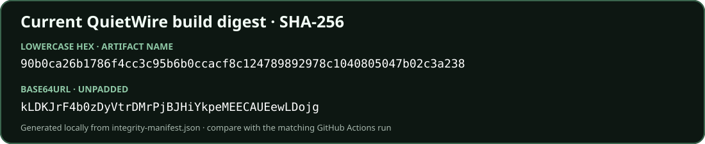

**[Türkçe README](README.tr.md)**

# KageTamga

> Trust the mark, not the network.

Browser-only P2P messaging with fingerprint trust, signed peer introductions, and Curve25519 + ML-KEM-768 E2EE.

## Etymology

**KageTamga** is an intentionally coined Japanese–Turkic name. *Kage* (影) means “shadow” in Japanese; *tamga* is a historic Turkic mark or seal associated with identity and provenance. Together they suggest a private mark that can be independently verified—the app's full-fingerprint trust model.

> **Security status:** this is an unaudited MVP, not a replacement for a professionally audited messenger. Its FIPS 203 ML-KEM-768 layer is an application-specific, pure-JavaScript defense in depth. Read [SECURITY.md](SECURITY.md) and the [threat model](docs/THREAT-MODEL.md) before sensitive use.

## Contents

- [Quick start](#quick-start)
- [Overview](#overview)
- [Trust and peer introduction](#trust-and-peer-introduction)
- [Message protection](#message-protection)
- [Storage, backup, and privacy](#storage-backup-and-privacy)
- [Integrity model](#integrity-model)
- [Documentation](#documentation)
- [Development](#development)
- [License](#license)

## Quick start

### 1. See the demo and verify it

**Demo URL placeholder:** [https://example.invalid/kagetamga](https://example.invalid/kagetamga) <!-- Replace with the public KageTamga demo URL. -->

Open the repository's main source page through a separately trusted path, then compare either complete digest shown by the app with this static build card. The browser-console command below asks the controlling integrity Service Worker to re-hash its pinned cache and prints both lowercase hexadecimal and unpadded Base64URL SHA-256 encodings.

[](https://github.com/SeriousPassenger/KageTamga)

<!-- kagetamga-integrity-console:start -->
#### Verify the deployed build in your browser

After KageTamga passes mandatory preflight, open the deployed app's browser developer console and paste this complete command:

```js
await (async () => {
  const registration = await navigator.serviceWorker.ready;
  const worker = navigator.serviceWorker.controller;
  const expectedScope = new URL(".", location.href).href;
  const expectedWorkerUrl = new URL("integrity-worker.js", expectedScope).href;
  if (registration.scope !== expectedScope || !worker || worker.scriptURL !== expectedWorkerUrl) {
    throw new Error("The expected KageTamga integrity worker does not control this page.");
  }
  if (registration.waiting) {
    throw new Error("A waiting integrity-worker update must be resolved before comparison.");
  }

  const channel = new MessageChannel();
  const result = await new Promise((resolve, reject) => {
    const timeout = setTimeout(() => reject(new Error("Integrity verification timed out.")), 10000);
    channel.port1.onmessage = ({ data }) => {
      clearTimeout(timeout);
      if (data?.ok && typeof data.buildDigest === "string") resolve(data.buildDigest);
      else reject(new Error(data?.error || "Integrity verification failed."));
    };
    worker.postMessage({ type: "VERIFY_PINNED_SHELL" }, [channel.port2]);
  });

  if (!/^[A-Za-z0-9_-]{43}$/.test(result)) {
    throw new Error("The worker returned a non-canonical SHA-256 digest.");
  }
  const padded = result.replaceAll("-", "+").replaceAll("_", "/").padEnd(44, "=");
  const binary = atob(padded);
  const bytes = Uint8Array.from(binary, (character) => character.charCodeAt(0));
  const canonical = btoa(String.fromCharCode(...bytes))
    .replaceAll("+", "-")
    .replaceAll("/", "_")
    .replace(/=+$/, "");
  if (bytes.length !== 32 || canonical !== result) {
    throw new Error("The worker returned a non-canonical SHA-256 digest.");
  }

  const output = Object.freeze({
    algorithm: "SHA-256",
    base64Url: result,
    hex: Array.from(bytes, (byte) => byte.toString(16).padStart(2, "0")).join(""),
  });
  console.log("KageTamga build digest (SHA-256, Base64URL unpadded):", output.base64Url);
  console.log("KageTamga build digest (SHA-256, lowercase hex):", output.hex);
  return output;
})()
```

It requires the exact application-path-scoped `integrity-worker.js` controller, asks that Service Worker to reverify its pinned manifest and cache, validates the returned 32-byte SHA-256 value, and prints and returns both lowercase hexadecimal and unpadded Base64URL encodings. Compare either complete value with the static digest card above through a separate view of the repository's main source page.

> This is a local pinned-shell consistency check, not a trustless proof. First-use delivery, later Service Worker updates, GitHub, the build environment, the browser, and the endpoint remain trust boundaries.
<!-- kagetamga-integrity-console:end -->

### 2. Host your own static build

Requirements: Node.js 22 or newer, npm, an HTTPS static host, and no application backend.

```bash
git clone https://github.com/SeriousPassenger/KageTamga.git
cd KageTamga
npm ci
npm run build
```

Publish the contents of `dist/` at either an origin root or a static-host subpath. Do not modify, minify, inject into, or transform the generated files after the build. The included `_headers` file applies the preferred security policy on hosts that support that format; the pinned browser Service Worker also serves the verified shell with mandatory CSP and cross-origin-isolation headers after one guarded first-use reload. See the [deployment guide](docs/DEPLOYMENT.md) for generic hosting and verification requirements.

### 3. Run locally

```bash
git clone https://github.com/SeriousPassenger/KageTamga.git
cd KageTamga
npm ci
npm run dev
```

Open the printed localhost URL in two separate browser profiles. Each browser creates or imports an identity, opens the same room link, and manually exchanges the first encrypted offer/answer codes. `npm run dev` builds and previews the same integrity-pinned static distribution used for deployment.

## Overview

KageTamga is a backend-free, small-group messenger. Chat ciphertext travels over WebRTC data channels directly between browsers. The first two participants exchange room-key-encrypted WebRTC offer/answer codes through any channel they already have. Once trusted peers are connected, they may introduce additional participants across the existing P2P mesh using independently signed newcomer data wrapped in a second signature from each relayer—but only to browsers that already trust that newcomer's fingerprint independently.

There is no application signaling server, account, central transcript, offline mailbox, runtime CDN, analytics SDK, or mandatory relay service. Public STUN endpoints are the configurable default for network-path discovery; users may replace them, add TURN credentials, or leave the list empty for LAN-only host candidates. STUN and TURN never discover room members and cannot replace offer/answer signaling.

Key properties:

- Full-mesh WebRTC messaging for roughly 2–8 simultaneously connected participants.
- OpenPGP v4 identities hard-restricted to Ed25519 signing and X25519 encryption, including every certificate subkey.
- A mandatory FIPS 203 ML-KEM-768 key pair bound inside every signed room identity assertion.
- Full 40-hex fingerprint display, QR presentation, copying, and explicit independent comparison.
- Persistent, owner-signed, origin-scoped trusted-fingerprint records available before room creation.
- English, German, Japanese, Turkish, Spanish, French, Simplified Chinese, and Traditional Chinese.
- Optional redacted developer JSON per application, room, and individual message.

## Trust and peer introduction

Trust is local, directional, and non-transitive. A valid signature proves possession of a key; it does not establish who controls that key.

1. Before creating or joining a room, users can inspect their persistent trusted-fingerprint list or add a contact using the complete public key and independently compared 40-hex fingerprint.
2. The first connection uses a manually exchanged encrypted offer and answer. Each exact SDP description and signed identity assertion is signed by its originating peer.
3. A participant becomes a permitted relayer only when its exact fingerprint is already in the receiver's persistent, locally owner-signed trust list.
4. The introduced origin fingerprint must separately already exist in every receiver/intermediate browser's own persistent trust list. A relayer's trust never transfers.
5. A relayed introduction contains the newcomer's signed identity or signed targeted SDP, plus a fresh room-, target-, hop-, nonce-, and timestamp-bound signature from the direct relayer. Every subsequent hop replaces that outer relayer signature with its own.
6. Unsigned, invalid, stale, replayed, or non-persistently-trusted setup is dropped before connection processing. Red chat events contain the denied direct-relayer or introduced-origin fingerprint. A peer asked to forward through an untrusted next hop or for an untrusted origin also records the local error and does not forward.

A participant not already trusted by a receiver must connect to that receiver manually for independent verification or be added to the persistent list through a separately obtained public key. Valid signatures prove the presented keys; they never create trust.

Multiple transport sessions carrying the same valid fingerprint appear as one identity. The newest active signed assertion supplies the current display name; an online session wins over an offline copy. Distinct fingerprints never merge, even when their display names match. Offline and ignored identities are collapsed behind a separate toggle.

## Message protection

Every chat message uses the versioned `OpenPGP-Curve25519+ML-KEM-768/AES-256-GCM-v1` envelope:

1. OpenPGP.js signs the plaintext with Ed25519 and encrypts it to the sender plus each locally trusted X25519 recipient.
2. The browser generates a fresh random AES-256-GCM content key and encrypts that signed OpenPGP ciphertext.
3. For each selected recipient, ML-KEM-768 encapsulation and HKDF-SHA-512 derive a recipient-specific AES key that wraps the fresh content key.
4. A signed delivery manifest binds the exact outer envelope, message ID, sender, room, timestamp, and sorted recipient fingerprint set.

The content key is never sent in plaintext and there is no shared room message key. A join, leave, ignore, or trust change alters the independently selected recipients of later messages; it does not rotate a global AES key. This is not Signal's Double Ratchet and does not claim application-layer forward secrecy or post-compromise security.

A validly signed message from a locally untrusted sender can be decrypted only if that sender selected the viewer as a recipient; it is displayed in red until the sender fingerprint is independently verified. A sender that has not trusted the viewer does not wrap the message key for that viewer, so only the encrypted envelope and delivery manifest are visible.

## Storage, backup, and privacy

- Private keys, signed trusted-contact records, and encrypted message records stay in origin-scoped IndexedDB until the user purges them.
- Chat plaintext is kept only in the current page state. Other participants may retain their own copies; local purge cannot erase another device.
- The random 256-bit room capability remains after `#room=` in the URL, so normal HTTP requests omit it. Anyone who obtains the complete link can still attempt a connection; the link is not an identity proof.
- `name.kagetamga.json` can be downloaded at any time after unlock. Its encrypted payload contains the full OpenPGP identity, passphrase-protected ML-KEM secret, revocation certificate, and owner-signed persistent trusted-fingerprint list. The identity/trust payload is encrypted with AES-256-GCM under a key derived from the unlocked ML-KEM secret; the protected ML-KEM secret remains passphrase-gated for restoration.
- ICE endpoints and TURN credentials remain only in the current tab's memory and are not backed up.
- Direct WebRTC peers normally learn one another's network addresses. Configured STUN operators can see address/timing metadata; TURN operators additionally relay already encrypted packet traffic.

## Integrity model

All production JavaScript, CSS, cryptographic libraries, and licenses are shipped locally with no runtime CDN. The build hashes every generated HTML/JavaScript/CSS asset, stamps that shell digest into `integrity-worker.js`, hashes the stamped worker too, and publishes the canonical map as `integrity-manifest.json`. The Service Worker installs a build-specific cache only after matching every digest, then refuses every unpinned request inside the application path.

This is trust on first use, not an independent proof. A malicious first response, malicious Service Worker update, compromised source/build account, hostile browser extension, browser vulnerability, malware, or unlocked endpoint can still capture secrets. Compare the full build digest from a separately obtained repository view and review the [threat model](docs/THREAT-MODEL.md).

## Documentation

| Document | Purpose |
| --- | --- |
| [User guide](docs/USER-GUIDE.md) | Identities, pre-room trust, rooms, manual connection, peer states, backups, purge, and developer mode |
| [Architecture](docs/ARCHITECTURE.md) | Static delivery, browser mesh, dual-signed introductions, message encryption, storage, and exposure |
| [Threat model](docs/THREAT-MODEL.md) | Trust boundaries, attacker capabilities, guarantees, exclusions, and limitations |
| [Deployment guide](docs/DEPLOYMENT.md) | Generic static hosting, security headers, integrity validation, and release checks |
| [Security policy](SECURITY.md) | Private vulnerability reporting, security status, and high-value review areas |
| [Contributing guide](CONTRIBUTING.md) | Required tests and privacy, cryptographic, frontend, protocol, and documentation invariants |
| [Third-party notices](THIRD_PARTY_NOTICES.md) | Bundling policy, attribution, and complete production license generation |

## Development

```bash
npm ci
npm run typecheck
npm test
npm run build
npm run check
```

`npm run check` runs strict TypeScript, all tests, the production build, complete production-license generation, integrity-worker stamping, manifest generation, the security build verifier, and the static digest card update. CI also audits dependencies, verifies the README console command and digest card, and uploads `integrity-manifest.json` under the build digest's lowercase hexadecimal filename.

Read [CONTRIBUTING.md](CONTRIBUTING.md) before changing cryptography, signed fields, persistent trust, peer introduction, browser storage, integrity controls, translations, ICE behavior, or security headers.

## License

[MIT](LICENSE) © 2026 SeriousPassenger <seriouspassenger@proton.me>
