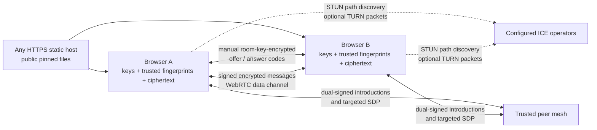

# KageTamga architecture

KageTamga is a static browser application. It has no application backend, rendezvous API, WebSocket service, account database, message store, or offline mailbox. The static host delivers public files; participant browsers perform identity management, signaling, trust decisions, cryptography, local storage, and chat transport.

## System view

The static host never participates in room membership or chat transport. It still sees ordinary asset-request metadata and remains a first-use code-delivery trust boundary.

## Build and browser integrity

The production build emits relative asset URLs, so the same `dist/` directory can be served from an origin root or a subpath. It then:

1. bundles all runtime JavaScript and CSS locally;
2. includes complete license text for the application and every production dependency;
3. hashes each generated HTML, JavaScript, and CSS asset with SHA-256;
4. stamps the canonical shell digest into `integrity-worker.js`;
5. hashes the stamped Service Worker and creates `integrity-manifest.json`;
6. rejects known analytics markers and remote script/style references in generated output.

On first use the browser registers the Service Worker at the application path. Because code already executed on that first navigation cannot authenticate itself retroactively, the startup gate permits exactly one guarded reload. On the next navigation the expected Service Worker must already control the page. It serves only digest-verified pinned documents, scripts, styles, and workers from a build-specific Cache Storage entry and adds the mandatory CSP, Trusted Types, COOP, COEP, CORP, permissions, framing, referrer, and MIME protections.

This is a consistency and trust-on-first-use mechanism. The host can return a malicious first shell and malicious Service Worker update together. Independent digest comparison may reveal a wrong build, but cannot make a compromised browser trustworthy.

## Identity profile

Each local identity contains:

- one OpenPGP v4 certificate with a 40-hex fingerprint;
- an Ed25519 primary/signing key;
- an X25519 encryption subkey;
- no RSA, NIST-curve, or other hidden subkeys;
- one FIPS 203 ML-KEM-768 key pair;
- an optional OpenPGP revocation certificate;
- a display name.

The key-policy validator checks the primary key, selected signing and encryption keys, and every subkey. Unsupported, expired, revoked, mixed-algorithm, malformed, or fingerprint-inconsistent identities hard-fail before use.

The OpenPGP private key and ML-KEM secret are protected by the user's passphrase in IndexedDB. The ML-KEM public key, complete OpenPGP public certificate, full fingerprint, display name, room ID, temporary peer ID, session nonce, and timestamp are bound by an Ed25519-signed room identity assertion. Assertions are accepted only within a short clock window and for the exact room and peer session.

## Room capability

A room begins with 32 random bytes encoded as 43 unpadded Base64URL characters in `#room=…`. URL fragments are not included in normal HTTP requests. The browser derives:

- an opaque SHA-256 room identifier; and
- an AES-256-GCM signaling key through HKDF-SHA-256.

The room capability is not an identity credential. Anyone who gets it can derive the manual-code encryption key and attempt a peer connection. Fingerprint verification and signatures remain mandatory.

## Manual first connection

There is no central discovery mechanism. The initial pair uses a two-step exchange:

1. Browser A creates a complete non-trickle WebRTC offer, waits for ICE gathering, embeds its signed room identity, signs the exact SDP and target context, encrypts the signed object under the room signaling key, and displays a `KTG1` code.
2. Browser B decrypts and validates the room, timestamp, nonce, identity, algorithm profile, origin signature, and exact offer. It creates and signs an answer, encrypts it under the same room signaling key, and returns a second code.
3. Browser A accepts only an answer matching an unused in-memory exchange ID from that tab.

Codes are size-limited, canonical Base64URL, AES-GCM authenticated, time-limited by their signed contents, and replay-tracked. The code may contain ICE candidates and therefore network metadata after decryption. It should be shared only with the intended room participant.

## Persistent trust before a room

The pre-room screen exposes the persistent trusted-fingerprint list. Adding an entry requires:

- a normalized contact name;
- the complete armored public key;
- its exact 40-hex fingerprint;
- explicit confirmation that every group was compared through an independent channel.

The client parses the public key, enforces the complete Ed25519/X25519 profile, confirms the fingerprint, and signs the contact record with the local identity owner key. Stored and imported records are used only after that owner signature verifies.

Human verification performed inside a room creates the same persistent signed record. A new session or new display name carrying the same valid fingerprint is recognized automatically. A different fingerprint using a known normalized name is a key-change state, not the same contact.

## Peer-assisted mesh expansion

After a direct peer is persistently trusted, it may introduce additional peers over the established encrypted data channel. Two independent signature layers are required:

### Origin signature

The newcomer signs its own room identity assertion. Any offer or answer also signs:

- exact room ID;
- origin and target peer IDs;
- exchange ID;
- timestamp and fresh nonce;
- complete SDP type and text;
- complete signed identity assertion.

A relayer cannot change the newcomer name, public keys, fingerprint, ML-KEM key, target, or SDP without invalidating this signature.

### Direct-relayer signature

The peer sending a control statement over the current data channel signs:

- exact room ID;
- its own peer ID and fingerprint;
- final target peer ID;
- hop count;
- timestamp and fresh nonce;
- the complete introduction or origin-signed signal.

The receiver first looks up the transport peer in its own persistent trust authorization. If that direct relayer fingerprint is absent, ignored, or changed, the statement is dropped without processing its nested payload and a red error shows the denied fingerprint. Valid signatures do not bypass this local allowlist. Unsigned, malformed, stale, replayed, wrong-room, wrong-target, or signature-invalid statements produce a separate red invalid-relay event.

After both cryptographic signatures verify, the receiver independently looks up the newcomer/origin fingerprint in the same persistent owner-signed list. If it is absent, the valid setup is still dropped and a second red event identifies the denied introduced fingerprint. This check applies to introductions and to the origin identity embedded in every relayed offer/answer.

At an intermediate hop, the previous direct relayer, embedded origin fingerprint, and next direct peer must all be locally trusted. The intermediate peer signs a new outer statement as the new direct relayer. A maximum hop count and replay caches limit loops. These controls authenticate every adjacent forwarding decision and require trust to preexist independently; no browser inherits another participant's decision.

An unknown newcomer can still connect manually to a participant, show its signed public identity, and be verified out of band. It cannot use peer-assisted expansion to a browser that has not already verified or pre-added its fingerprint.

## Peer identity presentation

Transport sessions are temporary; the full OpenPGP fingerprint is the durable UI identity.

- Sessions with the same valid signed fingerprint collapse into one peer.
- An active direct/relayed session is preferred over connecting, offline, or ignored copies.
- Among equivalent active sessions, the newest signed assertion supplies the current name.
- Unsigned sessions never borrow another session's identity.
- Different fingerprints remain separate even if their names match.
- Offline and ignored identities appear only inside a collapsed list.

## Chat message protection

The hard-required envelope label is:

`OpenPGP-Curve25519+ML-KEM-768/AES-256-GCM-v1`

For each message:

1. The sender creates a bounded JSON payload containing the message ID, room ID, name, fingerprint, timestamp, and plaintext.
2. OpenPGP.js signs it with Ed25519 and encrypts it with X25519 to the sender and each locally trusted recipient.
3. The browser generates a fresh 32-byte AES content key and 96-bit IV, then AES-256-GCM encrypts the complete armored OpenPGP ciphertext.
4. For each recipient, ML-KEM-768 encapsulates a fresh shared secret. Salted HKDF-SHA-512 derives a recipient-specific AES-256-GCM wrapping key. That key encrypts the 32-byte content key with algorithm, purpose, message ID, and recipient fingerprint bound as context/AAD.
5. A detached Ed25519 delivery-manifest signature binds the canonical outer envelope hash, sender, room, peer session, time, message ID, and canonical recipient fingerprint set.

The sender broadcasts the same encrypted envelope across connected channels. A peer without a matching KEM recipient entry cannot recover the content key. A recipient whose local trust does not include the valid signer may decrypt but sees a red untrusted message. Recipient selection is revalidated immediately before local persistence and again before the synchronous data-channel send, preventing a trust-change race from releasing an envelope to a just-revoked session.

There is no reusable room AES key and no silent fallback to OpenPGP-only, ML-KEM-only, RSA, another curve, or an unknown algorithm label. Unsupported algorithms, key sizes, extra fields, duplicate recipients, malformed encodings, recipient mismatches, bad manifests, invalid signatures, and conflicting authenticated message replays hard-fail.

## Local storage

IndexedDB stores:

- the passphrase-protected OpenPGP private key;
- the protected ML-KEM secret and public key;
- the owner-signed persistent contact list;
- encrypted message envelopes and signed delivery manifests;
- limited plaintext record metadata needed for room indexing and display.

Plaintext is present in memory after unlock/decryption. IndexedDB is origin-scoped, not a hardware-backed secret vault. Same-origin malicious code, an unlocked browser profile, endpoint malware, browser debugging, or hostile extensions may access it.

## Encrypted backup

The anytime download is named from the display name as `name.kagetamga.json`. Version 2 contains an outer header with the passphrase-protected ML-KEM secret and an AES-256-GCM ciphertext. The encryption key is derived from the unlocked ML-KEM secret through HKDF-SHA-512 with a dedicated backup context. Authenticated additional data binds the format, version, export time, algorithm, and protected-key header.

The encrypted payload contains the complete stored identity and every owner-signed trusted contact. Import first unlocks the protected ML-KEM secret using the passphrase, decrypts the payload, checks public/secret ML-KEM consistency, checks OpenPGP private/public/fingerprint consistency, enforces the key profile, and verifies every trusted-contact owner signature before an atomic IndexedDB replacement.

## ICE configuration

The pre-room screen accepts up to eight `stun:`, `stuns:`, `turn:`, or `turns:` URLs. TURN entries require both username and credential. Defaults are public STUN endpoints. Empty configuration restricts candidates to what the browser can gather without external ICE servers, which is mainly useful on a LAN.

STUN reveals address and timing information to its operator. TURN additionally sees and relays packet sizes/timing and network endpoints, although application payloads remain end-to-end encrypted. Custom ICE settings and credentials are tab-memory-only and excluded from backups and developer JSON.

## Resource limits

The browser limits room peers, cumulative peer IDs, pending manual offers, control/message size, WebRTC buffered data, hop count, nonces, ICE-gathering time, negotiation time, and disconnect grace periods. Ignoring a fingerprint closes every matching local session. These measures reduce accidental exhaustion and simple peer abuse; an arbitrary static host and browser still require normal network-level availability protection.
