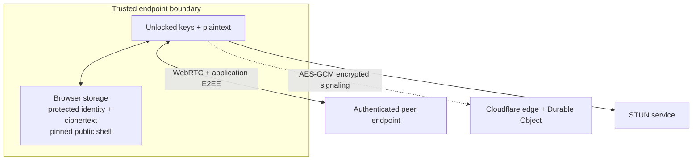

# Threat model

This document describes the intended security boundary of the current QuietWire MVP. It is a design record, not a cryptographic audit or proof. When this document and the code disagree, assume the code is authoritative and file an issue to correct the documentation.

## Scope and goals

QuietWire is designed for small, live conversations between people who can authenticate one another by comparing full OpenPGP fingerprints through a separate trusted channel.

The protocol aims to:

- keep message plaintext, room secrets, private keys, and passphrases out of Cloudflare application code and storage;
- provide confidentiality and sender authentication for chat messages after participants verify fingerprints;
- protect WebRTC SDP/ICE signaling contents from the Worker and Durable Object;
- add experimental protection against harvest-now/decrypt-later attacks with FIPS 203 ML-KEM-768 while retaining a classical OpenPGP Curve25519 layer;
- keep application-retained sensitive user data limited to passphrase-protected identity material, trust records, and message ciphertext in the browser between sessions, apart from explicit user downloads; and
- make unexpected key changes visible rather than silently accepting them.

It does **not** aim to provide anonymity, traffic-analysis resistance, offline delivery, remote deletion, a large-group protocol, endpoint protection, deniability, or a Signal-style Double Ratchet.

## Architecture and trust boundaries

### Participant browser

The participant's browser, operating system, device, and loaded application bundle are inside the trusted computing base. Plaintext and unlocked secret keys necessarily exist in JavaScript memory while in use. Browser crypto APIs, OpenPGP.js, `@noble/post-quantum`, the JavaScript runtime, and the dependency/build supply chain are trusted to behave correctly.

At rest, IndexedDB holds a passphrase-protected OpenPGP private key, locally protected ML-KEM secret material, signed trust/contact records, public identity information, and encrypted message envelopes. Cache Storage separately holds only the integrity manifest and its verified public HTML/JavaScript/CSS shell, including the build-stamped integrity worker. The integrity Service Worker does not intercept `/api` and does not cache keys, messages, or other user data.

The optional developer panels render JSON locally. Application, room, peer, and message metadata panels are separately allowlisted and redacted; they expose operational metadata including fingerprints, peer/message IDs, route/trust state, algorithm names, recipient sets, counts, approximate sizes, and plaintext character counts. A nested, collapsed, per-message panel deliberately exposes the raw encrypted transport JSON—signed delivery manifest, ciphertext envelope, signatures, nonces, salts, and encapsulations—for protocol inspection. Neither view contains passphrases, private keys, the room secret, or message plaintext. Nothing is transmitted merely by opening a panel, but a screenshot or copy can disclose identifiers, the trust graph, recipient sets, and encrypted traffic.

### Cloudflare Worker, Static Assets, and Durable Object

`assets.run_worker_first` is globally `true`, so every network request invokes Worker application code before the Static Assets binding. The Worker redirects an initial non-HTTPS request (except local development) before any shell is served and applies the authoritative CSP and other security headers to static and API responses alike. This costs a Worker invocation for each uncached network asset request. Once the integrity Service Worker controls the page, its verified build-specific cache serves the pinned executable shell locally and minimizes repeat edge requests; static network requests do not otherwise bypass the Worker.

The signaling Worker routes WebSockets to a room-specific Durable Object. The random 256-bit room secret remains in the URL fragment and is not included in HTTP requests. The browser derives a separate opaque room ID and signaling key from that secret. WebSocket upgrades require an exact same-origin `Origin`; this reduces cross-site initiation but does not authenticate a human who has the full room capability.

The Durable Object maintains live WebSocket connection state and peer presence. It forwards opaque, AES-256-GCM-encrypted SDP/ICE envelopes to a target peer. A room allows at most eight signaling sockets, and each socket permits at most 200 signaling messages in a 10-second window. The client independently caps its room roster at eight peers and stops accepting new identities after 32 unique peer IDs in one tab session. These bounds contain accidental and simple single-connection abuse; they are not a substitute for Cloudflare edge IP/rate rules or a comprehensive denial-of-service defense. The code does not call Durable Object storage or use D1, KV, R2, Queues, or an application message log. Hibernatable WebSocket connection state and attachments can exist within Cloudflare while a connection is active; this is transient routing state, not a durable transcript.

Cloudflare can observe:

- source IP addresses, TLS and request timing, sizes, and availability;
- the derived room identifier and ephemeral peer identifiers;
- room membership timing and WebSocket lifetime;
- ciphertext signaling envelope sizes and destinations; and
- static asset requests and deployment/account metadata.

Cloudflare should not learn the room secret, SDP/ICE contents, participant public keys, chat plaintext, or application chat ciphertext through the intended protocol. However, because Cloudflare serves the same-origin JavaScript bundle, a malicious Cloudflare account operator or compromised deployment can replace the client with code that exfiltrates those values. CSP cannot defend against malicious code intentionally served from `'self'`.

### Integrity shell and code delivery

The build first hashes the generated HTML/JavaScript/CSS shell without `/integrity-worker.js` and stamps that shell digest into the worker. It then creates `integrity-manifest.json` with SHA-256 digests for every pinned shell asset, including the stamped `/integrity-worker.js`; the complete build digest covers the canonical map including that worker. GitHub Actions prints the build digest and uploads the manifest as an artifact. The expected same-origin integrity Service Worker verifies that its embedded stamp equals the manifest's non-worker shell digest, fetches every listed asset with network-cache bypass, verifies each digest, and pins them under a build-specific `quietwire-pinned-shell-<shell-digest>` cache. Activation removes older QuietWire build caches. On first installation, preflight forces a reload so the app cannot continue until navigation is controlled by the pinned worker. Once controlling the page, it serves the pinned navigation/script/style/worker shell and fails closed for an unlisted document, script, style, or worker request. Startup preflight rejects an unknown Service Worker registration and asks the expected worker to reverify the pinned cache.

This is **trust on first use**, not signed code delivery independent of the origin:

- the first document and its JavaScript execute before they can install and verify the Service Worker;
- the integrity worker and manifest initially come from the same origin they are meant to constrain;
- the stamped integrity worker is covered by the manifest/build digest, but the browser's first worker installation and every update response are still delivered by that same origin;
- the integrity manifest itself defines the asset map, while response headers, Worker/Durable Object code, Wrangler settings, and Cloudflare account configuration are outside the build digest;
- a malicious origin or account operator can serve a malicious first build or Service Worker update; and
- comparing a displayed digest only with another value from the same page is not independent.

Comparing the complete digest against the matching GitHub Actions log/artifact through a separately trusted path can reveal some unintended deployments. It does not protect an already compromised browser, GitHub account/build chain, Cloudflare account, or origin.

### Direct peers and STUN

WebRTC data channels use DTLS transport protection, and chat messages are independently protected at the application layer. A peer receives the messages addressed to it and can save, export, quote, photograph, or forward plaintext. No protocol can force a recipient to forget data.

Direct ICE connectivity normally exposes public IP/network information to the other peer. Cloudflare's STUN service can also observe address and timing metadata. This release has no TURN relay. NAT/firewall combinations that cannot create a direct path will fail rather than silently relay.

After intended peers connect, a participant may locally lock signaling. This closes only that tab's WebSocket and prevents its automatic signaling reconnect for the rest of that room session; established data channels remain authoritative and continue carrying chat. It is not a Durable Object room lock, invite revocation, or global admission-control operation. Other clients can retain signaling, and anyone with the invite may attempt connections not involving the locked client. The locked client cannot negotiate new peers or recover a connection that later needs ICE/signaling; leaving or reloading creates a new unlocked session.

A participant may also ignore a fingerprint for the current room session. QuietWire closes the matching local P2P connection, suppresses further sends/receives for that peer ID, and closes a later peer connection after it asserts the same ignored fingerprint. This state is local to that tab and room session, is not stored as a server block, and does not revoke the room capability or prevent the ignored person from connecting to other peers. A new connection can exist briefly before its signed fingerprint is known.

## Cryptographic layers

### Room and signaling

Rooms use a 32-byte (256-bit) random secret encoded into the URL fragment. Domain-separated derivations produce:

- a SHA-256-derived public routing identifier; and
- an HKDF-SHA-256 AES-256-GCM key for SDP/ICE signaling.

Each encrypted signaling packet has a fresh 96-bit nonce. Roster events and ephemeral peer identifiers are not encrypted; SDP and ICE bodies are. Possession of the complete room link grants the ability to derive the signaling key and attempt to join, so the link must be treated as a secret capability. The derived 43-character base64url room ID is opaque, but it is still visible to Cloudflare and is stable for that room secret.

Sharing a link through email, social media, cloud clipboard, browser sync, or a URL-shortening service may disclose or persist its fragment even though the browser does not send that fragment as an HTTP `Referer`.

### Message and identity envelope

The versioned message construction is labeled:

`OpenPGP-Curve25519+ML-KEM-768/AES-256-GCM-v1`

It is a nested, application-specific composition:

1. OpenPGP.js creates an inner message encrypted with the recipients' X25519 OpenPGP encryption subkeys and signed by the sender's Ed25519 OpenPGP signing key.
2. For every message, the client generates a fresh independent random 256-bit content-encryption key and encrypts the inner armored OpenPGP message with AES-256-GCM using a fresh 96-bit IV and 128-bit tag.
3. For each recipient, FIPS 203 ML-KEM-768 encapsulates a 32-byte shared secret to that recipient's ML-KEM public key.
4. A domain-separated HKDF-SHA-512 derivation with a fresh 32-byte salt turns that shared secret into a per-recipient AES-256-GCM wrapping key, which wraps the content-encryption key with a fresh 96-bit IV and 128-bit tag.
5. The envelope contains its algorithm/version label, message ID, ciphertext, nonces, salts, recipient ML-KEM ciphertexts, and OpenPGP fingerprints—not plaintext or secret keys.

The ML-KEM public key is bound to the peer identity exchange, which is signed by the OpenPGP identity. Users must still verify the OpenPGP fingerprint out of band. Accepting an unverified replacement identity can also substitute its ML-KEM key.

ML-KEM-768 public keys, secret keys, and encapsulation ciphertexts are 1,184, 2,400, and 1,088 bytes respectively. An envelope accepts at most 32 distinct recipients and a 1 MiB inner armored OpenPGP ciphertext. These are parser/resource bounds, not a claim that a 32-person WebRTC full mesh is practical.

ML-KEM secret material is local. At rest, it is protected with PBKDF2-SHA-512 (600,000 iterations and a fresh 32-byte salt) plus AES-256-GCM (fresh 96-bit IV and 128-bit tag). It is decrypted into mutable browser-memory bytes while the identity is unlocked and is explicitly overwritten by the code after use where JavaScript permits. JavaScript runtimes and garbage collectors prevent a forensic guarantee that every copy was erased. PBKDF2 raises the cost of offline guessing but does not rescue a weak passphrase.

The signed identity assertion includes the room and temporary peer IDs, public OpenPGP key/fingerprint, ML-KEM algorithm/public key, issue time, and a fresh session nonce. This prevents silent substitution inside a valid assertion; it does not authenticate the human until the OpenPGP fingerprint is verified separately.

There is no shared room content key. A join, leave, ignore, or trust change alters only each sender's recipient selection for later messages, so no group-key rotation occurs. Removing a recipient does not erase content or keys that recipient already received, and a later long-term-key compromise can still affect recorded ciphertext as described below.

### OpenPGP identity policy

New identities use OpenPGP.js' standardized Curve25519 mode: Ed25519 for signatures and X25519 for encryption, with a v4 40-hex fingerprint. Imports and restores must pass the same profile. The application accepts the standard algorithms and OpenPGP's legacy Curve25519 encodings (`eddsaLegacy` and legacy Curve25519 ECDH), but rejects RSA, NIST P-curves, other signing/encryption algorithms, v6/64-hex fingerprints, revoked keys, expired keys, and invalid primary keys.

This OpenPGP identity and one exact FIPS 203 ML-KEM-768 key pair form a single required QuietWire profile. Peer assertions, local unlock, and backup verification reject a missing, non-canonical, wrong-size, wrong-algorithm, or mismatched ML-KEM key. There is no classical-only message mode, algorithm negotiation, or PQ downgrade. Importing a supported OpenPGP private key creates a fresh required ML-KEM-768 key and a new combined profile; only the resulting verified `.quietwire.json` contains all material needed to recover that profile.

This strict allowlist keeps the UI/protocol label and full-fingerprint comparison length deterministic. It is an application interoperability choice, not a claim that other OpenPGP algorithms are universally insecure.

### Why this is not called X-Wing

An early design considered an X-Wing ML-KEM-768/X25519 helper. The current implementation deliberately does **not** claim X-Wing compatibility. It uses standardized FIPS 203 ML-KEM-768 as an outer confidentiality layer around the existing, independent classical OpenPGP Curve25519 encrypted-and-signed message. This avoids depending on a draft X-Wing helper and avoids suggesting wire compatibility with a draft construction that the code does not implement.

The overall nesting and key-binding protocol remains project-specific and unaudited. `@noble/post-quantum` is a pure-JavaScript implementation; JavaScript engines do not provide the strong constant-time execution guarantees available to carefully audited native cryptographic implementations. Treat the PQ layer as experimental defense in depth, not as proof of quantum-safe messaging.

### Authentication caveat

ML-KEM supplies key encapsulation, not identity signatures. Sender authentication still depends on the inner Ed25519 OpenPGP signature and a human-authenticated 40-hex OpenPGP v4 fingerprint. Therefore, this design does **not** provide post-quantum authentication. A future cryptographically relevant attacker capable of breaking the classical signature scheme could attack identity authentication even if ML-KEM confidentiality remains intact.

### No ratchet claim

This MVP does not implement a Double Ratchet, per-message deletion of old key state, post-compromise security, or an independently analyzed group key agreement. Long-term private-key compromise may expose recorded ciphertext intended for that key. WebRTC DTLS may have its own transport properties, but those do not create an application-level forward-secrecy claim for stored message envelopes.

Versioned message IDs support local duplicate handling, but this MVP does not claim a formally analyzed global ordering, freshness, or replay-prevention protocol across disconnected/restored sessions.

## Identity authentication

Room membership and encryption alone do not authenticate a person's identity. An attacker with the room link can choose a familiar display name and offer a different key.

The safe procedure is:

1. reveal the full 40-hex OpenPGP v4 fingerprint for the peer;
2. compare every hexadecimal character over a separate trusted path;
3. only then mark it verified; and
4. stop and repeat verification after any key-change warning.

In-person comparison, a known voice/video call, or a previously authenticated account can provide the separate path. A QR code reduces transcription mistakes but is not automatically trusted; the origin of the QR must itself be authenticated. Display names, short key IDs, profile text, room links, and “encrypted” indicators are not sufficient.

Contacts are trust-on-first-use until manually verified. A key-change warning detects change relative to local state; it cannot tell whether the old key, the new key, or the device is legitimate.

### Directional trust and delivery evidence

Trust is local to the participant who performed the full-fingerprint comparison, directional, and non-transitive. Alice verifying Bob authorizes Bob as a recipient of Alice's later messages; it does not make Bob trust Alice. Alice trusting Bob and Bob trusting Carol does not make Alice trust Carol.

When a participant verifies a peer, QuietWire broadcasts a signed, room-scoped trust announcement naming the initiator and subject fingerprints. Receivers independently validate the announcement against the initiator's signed room identity. The statement is informational: it never changes a receiver's local contact record, grants reverse trust, or creates transitive trust. These announcements disclose part of the directional trust graph to every room peer that receives them.

For each message, the sender builds the cryptographic recipient set from the sender's own identity plus connected peers that the sender has locally verified. The encrypted packet is broadcast across the room mesh, but only listed recipients have OpenPGP and ML-KEM material needed to decrypt. A detached OpenPGP signature over a delivery manifest binds the room/sender context, message ID, SHA-256 digest of the exact canonical hybrid envelope, and sorted exact recipient fingerprints.

Consequently:

- an excluded peer can verify the authenticated not-shared state and inspect the encrypted envelope/recipient list, but cannot decrypt the plaintext;
- an included recipient can decrypt even when that recipient has not locally verified the sender, so the UI shows that validly signed message in red as untrusted;
- a signature proves control of the displayed key, not that the human behind it was verified or that its links/instructions are benign; and
- a successful local data-channel send is not a delivery/read receipt. The protocol has no peer acknowledgement proving receipt, decryption, display, or reading.

The exact delivery recipient lists and trust announcements are metadata visible to connected room peers. They can reveal exclusions and portions of the social/trust graph even when message plaintext remains confidential.

## Attacker analysis

| Attacker | What the design helps protect | What remains possible |
| --- | --- | --- |
| Passive network observer | HTTPS/WSS, DTLS, signaling AES-GCM, and message E2EE hide contents | Traffic timing, size, endpoints, and availability remain observable |
| Honest-but-curious Cloudflare | Room secret, signaling bodies, chat contents, and private keys are absent from intended server data | Infrastructure metadata, derived room/peer IDs, and every uncached asset request remain visible |
| Compromised Cloudflare deployment | No durable server transcript exists from earlier chats | First-load or malicious Service Worker/update code can steal future plaintext, keys, and room secrets |
| Person with room link | Cannot impersonate a previously verified fingerprint without a key-change warning | Can join within room bounds, disrupt, claim a name, collect trust/recipient metadata, and socialize an unverified key |
| Malicious participant | Cannot forge another participant's valid signature or signed delivery selection without that key | Can retain/forward received content, screenshot, send harmful but validly signed plaintext, spam, lie, and expose peer IPs; local ignore is not a server block |
| Stolen encrypted browser profile | Passphrase protection raises the cost of key recovery; messages remain ciphertext | Offline guessing, browser implementation flaws, or a weak passphrase may expose keys |
| Malware/hostile extension | No meaningful protection once it can read the app's DOM or memory | Can capture plaintext, passphrases, room links, and unlocked keys |
| Quantum-capable future adversary | Experimental ML-KEM layer is intended to protect content-key delivery | Classical OpenPGP authentication, implementation errors, endpoints, and metadata remain |
| Availability attacker | Origin checks, peer/client caps, parser bounds, and per-socket rate limits constrain some abuse; message/key persistence is not centralized | Distributed or IP-rotating traffic can still flood the public Worker/rooms; no strong admission control, server block, or guaranteed delivery exists |

## Privacy and metadata controls

Because `assets.run_worker_first` is globally enabled, the Worker applies a same-origin-only Content Security Policy, cross-origin isolation, restrictive Permissions Policy, `no-referrer`, `no-store`, and related headers to every static and API response before serving it. The bundle has no intentional external script, font, analytics, or RUM. It has exactly one intentional same-origin integrity Service Worker and a build-specific Cache Storage entry for the verified public shell. Wrangler disables Workers observability.

Operators must separately disable Cloudflare Web Analytics/Browser Insights and verify that the platform did not inject `beacon.min.js`, `cloudflareinsights.com`, or `/cdn-cgi/rum`. Those defaults are account/zone settings and cannot be guaranteed by source code alone. Cloudflare may still retain operational/security metadata under its own policies even when Workers Logs are disabled.

## Deletion and backup semantics

- **Purge conversation** deletes that room's local IndexedDB message records only.
- **Purge identity** deletes the local identity record and all locally signed contact/trust records. Encrypted messages remain and may become unusable/orphaned.
- **Purge all** deletes the QuietWire IndexedDB database, clears local/session storage, deletes all Cache Storage entries for the origin, and unregisters all Service Workers on that origin. The subsequent reload establishes a new integrity trust-on-first-use installation.
- None of these operations can delete a peer's copy, an export, screenshot, operating-system backup, synced browser data, or forensic remnant.

These deletion APIs are not forensic secure erase; browsers, filesystems, synchronization tools, crash dumps, and backups may retain remnants.

There is no server recovery. The complete `.quietwire.json` backup contains the passphrase-encrypted OpenPGP private key, separately PBKDF2/AES-GCM-protected ML-KEM secret, public identity data, and any generated revocation certificate. The application verifies a candidate backup locally by unlocking it and checking both the OpenPGP fingerprint and derived ML-KEM public key. The file remains sensitive because it permits offline passphrase guessing.

The identity backup does not include message history, signed trust/contact records, settings, or the integrity cache.

The `.quietwire.json` file is the one complete combined-identity recovery bundle. Local unlock and restore hard-fail unless its v4 Ed25519/X25519 OpenPGP material and exact ML-KEM-768 key pair match their recorded public identity. The separately exported `.private.asc` contains only the OpenPGP private key. Importing it generates a fresh required ML-KEM-768 key and requires verification of a new complete `.quietwire.json` backup before the profile is saved; it is not a classical-only operating mode, cannot recover old outer ML-KEM envelopes, and is not a complete QuietWire restore. Public `.asc` and revocation-certificate exports remain useful for sharing and OpenPGP revocation respectively.

## Assumptions that must remain true

- Cryptographically secure browser randomness is available.
- Nonces and message identifiers are never intentionally reused with the same key.
- The room link is shared only through an appropriate channel.
- Participants compare the complete fingerprint before treating a key as authenticated, and no peer's trust announcement is treated as local, reverse, or transitive trust.
- Each sender selects recipients only from that sender's own locally verified contacts; signed delivery manifests continue to bind the exact envelope and recipient set.
- Dependencies and build inputs have not been compromised.
- The expected integrity Service Worker, manifest, pinned cache, and independently compared build digest have not been substituted.
- Production keeps Browser Insights, Web Analytics, Workers Logs, third-party scripts, and server-side message storage disabled.
- Security-sensitive behavior is tested after dependency, protocol, CSP, Worker, and browser-support changes.

Changes that invalidate an assumption require a threat-model update before release.
